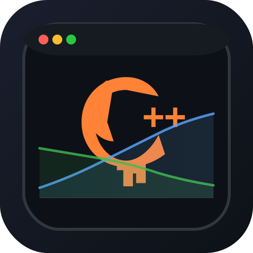
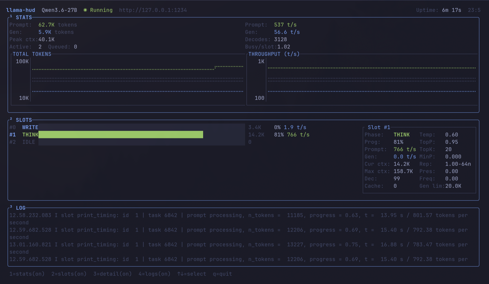

<div align="center">
  
  <h1>llama-hud</h1>
</div>

btop-style terminal dashboard for monitoring [llama-server](https://github.com/ggml-org/llama.cpp).

Monitors prompt processing, token generation, and server metrics in real-time. No server management — observe only.


## Install

```bash
cargo install --locked llama-hud
```

Or build from source:

```bash
git clone git@github.com:mscheurwater/llama-hud.git
cd llama-hud
cargo build --release
cp target/release/llama-hud ~/.local/bin/
```

## Usage

```bash
# Default: http://127.0.0.1:8080
llama-hud

# Custom server
llama-hud --url http://192.168.1.50:8080

# With log tailing (requires tmux)
llama-hud --tmux-session my-llama-session
```

## Config

First run opens the config editor. After that, `~/.config/llama-hud/config.json`:

```json
{
  "url": "http://127.0.0.1:8080",
  "tmux_session": null,
  "slots_poll_ms": 500,
  "metrics_poll_ms": 2000,
  "chart_history": 600,
  "theme": "default"
}
```

Press `ESC` in the app to edit config live.

## Views

| Key | View | Description |
|-----|------|-------------|
| `1` | Stats | Server-wide totals + charts (tokens, throughput) |
| `2` | Slots | Per-slot progress, phase, TPS |
| `3` | Detail | Selected slot params (temp, top_p, cache, etc.) |
| `4` | Logs | Server log stream (requires tmux) |
| `↑↓` | Select | Navigate slots |
| `q` | Quit | Exit |

## Themes

default, nord, gruvbox, catppuccin, dracula, tokyo-night, kanagawa, onedark, horizon, flexoki

Cycle with `← →` in the config editor.

---

> Entirely vibe-coded with **Qwen3.6-27B-Q4_K_XL**, **llama.cpp**, and **Pi**.
